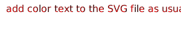

:sunny:
:umbrella:
:cloud:
:snowflake:
:snowman:
:zap:
:cyclone:
[絵文字チートシート](http://www.emoji-cheat-sheet.com/)

:+1: option + shift +¥

:o:
☕︎
ˆˆ```µ˜˜˜\\\\\\^^^^^¥^∏∏Ø؈„´€›fi‹›—±|ÚÆ¿˘˜Â◊»-Œ„ÎÎÆÚÒÔÓ˝Î

:snail:
:octopus:
:tropical_fish:
:fish:
:whale:
:whale2:
:dolphin:
[color](https://www.colorhexa.com/f01589)
***
  `ha`
-  `#c5f015`
-  `#1589F0`
-  `#f01589`

 
♨︎
***
:dragon:
:goat:
:rooster:
:dog2:
:pig2:
:mouse2:
:ox:
:dragon_face:
:blowfish:
:crocodile:
:dromedary_camel:
:leopard:
:cat2:
[常用HTML颜色表-HTML颜色代码色彩表](http://www.divcss5.com/html/h636.shtml)
:cherry_blossom:
:tulip:
:four_leaf_clover:
:rose:
:sunflower:
:hibiscus:
:maple_leaf:
:leaves:
:fallen_leaf:
:herb:
:mushroom:
:cactus:
:palm_tree:
:evergreen_tree:
:deciduous_tree:
:chestnut:
:seedling:
:blossom:
:ear_of_rice:
:shell:
:globe_with_meridians:
:sun_with_face:
:full_moon_with_face:
:new_moon_with_face:
:new_moon:
:waxing_crescent_moon:
:first_quarter_moon:
:waxing_gibbous_moon:
:full_moon:
:waning_gibbous_moon:
:last_quarter_moon:
:waning_crescent_moon:
:last_quarter_moon_with_face:
:first_quarter_moon_with_face:
:crescent_moon:
:earth_africa:
:earth_americas:
:earth_asia:
:volcano:
:milky_way:
:partly_sunny:
:octocat:

https://www.markdownguide.org/extended-syntax/
ここは`color: #FF00FF`にしてください。
<!-- blank line -->
----
<!-- blank line -->
<link rel=”stylesheet” href=”http://blog.championswimmer.in/assets/css/pygments/solarized-light.css">
<!-- blank line -->
<figure class="video_container">
  <iframe src="https://www.youtube.com/embed/enMumwvLAug" frameborder="0" allowfullscreen="true"> </iframe>
</figure>
<!-- blank line -->

```diff
#  haha in blue
-  this text  in red
+ text in green
! text in orange
```
>:o: SVG
<a></a>
<br>
>color  https://github.com/fan2/Markdown/blob/master/Markdown%20Tutorials.md
----

>it adds it as a new line starting with either - + ! #  

```diff
- text1 in red
+ text2 in green
! text3 in orange
# text4 in gray
```

>github Markdown
https://help.github.com/en/categories/writing-on-github

>Markdown: Syntax
https://daringfireball.net/projects/markdown/syntax

```rb
\   backslash
`   backtick
*   asterisk
_   underscore
{}  curly braces
[]  square brackets
()  parentheses
#   hash mark
+   plus sign
-   minus sign (hyphen)
.   dot
!   exclamation mark
```

><color>
  
[^1]インラインコードの中身が CSS の <color> rgb(255,0,0)型の RGB 16進数表記, rgb(), rgba(), hsl(), hsla() 場合横にその色が表示されます。

#ffce44
rgb(255,0,0)
rgba(0,255,0,0.4)

***
> ＊折りたたまれる部分全体を<div>

<details><summary>サンプルコード</summary><div>
  
```rb
puts 'Hello, World'
```

</div></details>

>Strikethrough - 打ち消し線
打ち消し線を使うには ~~ で囲みます。 ~~打ち消し~~

```rb
puts 'Hello, World'
```

>注釈

本文中に[^1]や[^example]のように文字列を記述することで、脚注へのリンクを表現できます。注釈内容は、同じく本文中に [^1]: ... というように記述します2。


# 1

## 2

_ か * で囲むとHTMLのemタグになります_Qiita_では*イタリック体*になります。
__ か ** で囲むとHTMLのstrongタグになります。Qiitaでは**太字**になります。

*haha*

`code`

*「\」
+ haha
- haha
**取り消し**

>修飾	Markdown	HTML

| ボールド | ** ** | <strong></strong> |
|:-----------|------------:|:------------:|
| イタリック       | * *	        | <em></em>         |
| コード     | ``	      | <code></code>       |
| リンク       | [text](url)	        | <a href="url">text</a>         |


>Checkbox型

前後にスペースが必要です。

- [ ] タスク1
- [x] タスク2

>Horizontal rules - 水平線
* * *
***
*****
- - -

>テーブル記法

| Left align | Right align | Center align |
|:-----------|------------:|:------------:|
| This       | This        | This         |
| column     | column      | column       |
| will       | will        | will         |

>絵文字チートシート

http://www.emoji-cheat-sheet.com/

>Disc型

文頭に「*」「+」「-」のいずれかを入れるとDisc型リストになります


>Definition型

HTMLの<dl>タグをそのまま使うことで実現できます。

<dl>
  <dt>リンゴ</dt>
  <dd>赤いフルーツ</dd>
  <dt>オレンジ</dt>
  <dd>橙色のフルーツ</dd>
</dl>

```math
\left( \sum_{k=1}^n a_k b_k \right)^{!!2} \leq
\left( \sum_{k=1}^n a_k^2 \right) \left( \sum_{k=1}^n b_k^2 \right)
```

[^1](https://qiita.com/Qiita/items/c686397e4a0f4f11683d)
[*](https://qiita.com/Qiita/items/c686397e4a0f4f11683d#2-9)


> ## This is a header.
> 
> 1.   This is the first list item.
> 2.   This is the second list item.
> 
> Here's some example code:
> 
>     return shell_exec("echo $input | $markdown_script");


```
<video id="video" controls="" preload="none" poster="http://media.w3.org/2010/05/sintel/poster.png">
      <source id="mp4" src="http://media.w3.org/2010/05/sintel/trailer.mp4" type="video/mp4">
</video>
```
```html
```json
   // code for coloring
```
```html
   // code for coloring
```
```js
   // code for coloring
```
```css
   // code for coloring
```
<table><tr><td bgcolor=#7FFFD4>这里的背景色是：Aquamarine，  十六进制颜色值：#7FFFD4， rgb(127, 255, 212)</td></tr></table>

浅红色文字：<span style="color:red;">浅红色文字：</span><br /> 
深红色文字：<font color="#660000">深红色文字</font><br /> 
浅绿色文字：<font color="#00dd00">浅绿色文字</font><br /> 
深绿色文字：<font color="#006600">深绿色文字</font><br /> 
浅蓝色文字：<font color="#0000dd">浅蓝色文字</font><br /> 
深蓝色文字：<font color="#000066">深蓝色文字</font><br /> 
浅黄色文字：<font color="#dddd00">浅黄色文字</font><br /> 
深黄色文字：<font color="#666600">深黄色文字</font><br /> 
浅青色文字：<font color="#00dddd">浅青色文字</font><br /> 
深青色文字：<font color="#006666">深青色文字</font><br /> 
浅紫色文字：<font color="#dd00dd">浅紫色文字</font><br /> 
深紫色文字：<font color="#660066">深紫色文字</font><br />

+可以选择你想要的颜色对应的RGB值。
http://www.114la.com/other/rgb.htm

>size

size为1：<font size="1">size为1</font><br /> 
size为2：<font size="2">size为2</font><br /> 
size为3：<font size="3">size为3</font><br /> 
size为4：<font size="4">size为4</font><br /> 
size为10：<font size="10">size为10</font><br /> 

>font

<font face="黑体">我是黑体字</font>
<font face="宋体">我是宋体字</font>
<font face="微软雅黑">我是微软雅黑字</font>
<font face="fantasy">我是fantasy字</font>
<font face="Helvetica">我是Helvetica字</font>

>background

<table><tr><td bgcolor=#FF00FF>背景色的设置是按照十六进制颜色值：#7FFFD4</td></tr></table>
<table><tr><td bgcolor=#FF83FA>背景色的设置是按照十六进制颜色值：#FF83FA</td></tr></table>
<table><tr><td bgcolor=#D1EEEE>背景色的设置是按照十六进制颜色值：#D1EEEE</td></tr></table>
<table><tr><td bgcolor=#C0FF3E>背景色的设置是按照十六进制颜色值：#C0FF3E</td></tr></table>
<table><tr><td bgcolor=#54FF9F>背景色的设置是按照十六进制颜色值：#54FF9F</td></tr></table>

```

